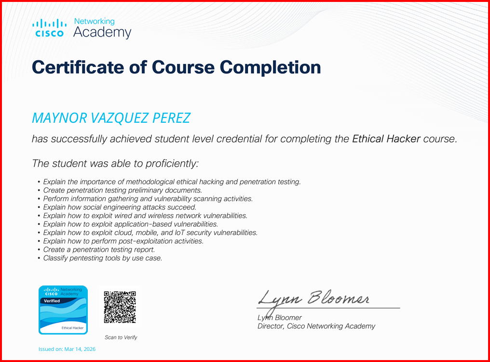
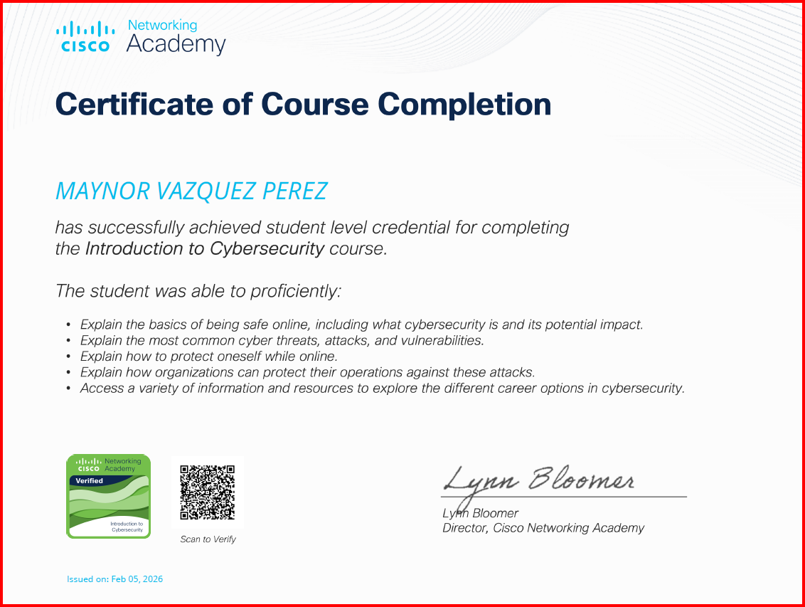

# 🖥️ [ SYSTEM STATUS: ONLINE ]

<p align="center">
  
  <br>
  
  
  
</p>

<h1 align="center"><font color="#00ff00">Maynor_Vazquez_Sec</font></h1>

---

## 🛰️ GLOBAL OVERVIEW & SEC-TIPS

<table width="100%">
  <tr>
    <td width="65%" valign="top">
      <h3>👨‍💻 PERFIL ACADÉMICO</h3>
      <ul>
        <li><b>Institución:</b> UnADM</li>
        <li><b>Carrera:</b> Ingeniería Industrial</li>
        <li><b>Matrícula:</b> ES251101986</li>
        <li><b>Especialidad:</b> Seguridad Ofensiva</li>
      </ul>
      <h3>📂 DIRECTORIO DE ACCESO</h3>
      <ul>
        <li>📁 <a href="./Bitacora-Diaria"><font color="#00ff00">Bitácora Diaria</font></a></li>
        <li>🛡️ <a href="./Writeups-Pentesting"><font color="#00ff00">Writeups & CTFs</font></a></li>
        <li>🐍 <a href="./Python-Scripts"><font color="#00ff00">Scripts Automatizados</font></a></li>
      </ul>
    </td>
    <td width="35%" valign="top" style="border-left: 1px solid #444; padding-left: 15px;">
      <h3>🛡️ CYBER-TIPS</h3>
      <p>⚠️ <b>MFA Siempre:</b> Activa doble factor en todo.</p>
      <p>🔑 <b>Pass Managers:</b> Usa Bitwarden o Keepass.</p>
      <p>📡 <b>VPN:</b> Nunca uses Wi-Fi pública sin cifrado.</p>
      <p>📂 <b>Backups:</b> Respalda offline (Regla 3-2-1).</p>
      <p>🔍 <b>Phishing:</b> Revisa enlaces antes de dar click.</p>
      <p>🚫 <b>Zero Trust:</b> No confíes, verifica siempre.</p>
    </td>
  </tr>
</table>

---

## 🎖️ CERTIFICACIONES OFICIALES (CISCO ACADEMY)

<p align="center">
  
  
</p>

---

## 🛠️ ARSENAL TÉCNICO & HABILIDADES

<table width="100%">
  <tr>
    <th>Reconocimiento</th>
    <th>Explotación</th>
    <th>Post-Explotación</th>
    <th>Desarrollo</th>
  </tr>
  <tr>
    <td>Nmap / Zenmap</td>
    <td>Metasploit Framework</td>
    <td>Privilege Escalation</td>
    <td>Python 3 / Bash</td>
  </tr>
  <tr>
    <td>Wireshark</td>
    <td>Hydra (Brute Force)</td>
    <td>Data Exfiltration</td>
    <td>Git / GitHub</td>
  </tr>
  <tr>
    <td>Burp Suite</td>
    <td>Sqlmap</td>
    <td>Network Persistence</td>
    <td>Linux SysAdmin</td>
  </tr>
</table>

---

## 💻 CONSOLA DE ACTIVIDAD RECIENTE

```bash
[root@mynor-sec-lab ~]# tail -n 5 log_actividad.txt
[2026-04-10] CONFIG: Migración a Modo Oscuro completada.
[2026-04-10] UPDATE: Estructura de columnas laterales activada.
[2026-04-10] DEPLOY: Sección de Cyber-Tips integrada al dashboard.
[2026-04-10] STATUS: Sistema optimizado para visualización completa.
